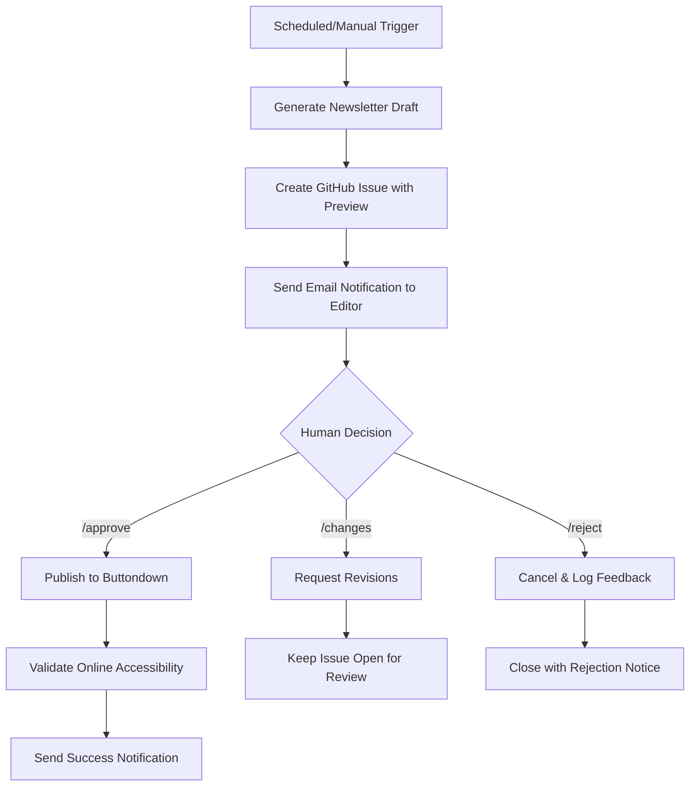

# Editorial Approval Workflow Setup

This guide explains how to configure and use the new human-approval editorial workflow for newsletter publishing.

## 🎯 Workflow Overview



## 📧 Email Notification Setup

Configure one of the following notification methods:

### Option 1: SMTP Email (Recommended)
Add these repository secrets:
```
SMTP_SERVER=smtp.gmail.com
SMTP_PORT=587
SMTP_USERNAME=your-email@gmail.com
SMTP_PASSWORD=your-app-password
SMTP_FROM_EMAIL=newsletter-bot@yourcompany.com
```

### Option 2: SendGrid
Add repository secret:
```
SENDGRID_API_KEY=your-sendgrid-api-key
SENDGRID_FROM_EMAIL=newsletter-bot@yourcompany.com
```

### Option 3: Discord/Slack Webhook
Add repository secret:
```
WEBHOOK_URL=https://discord.com/api/webhooks/...
```

### Option 4: GitHub Issues Only
No setup required - notifications will be posted as GitHub issue comments.

## 👤 Editorial Team Configuration

Set repository variable:
```
NEWSLETTER_EDITOR_EMAIL=editor@yourcompany.com
```

Or modify workflows to include multiple recipients.

## 🚀 How to Use

### 1. Automated Weekly Generation
- Runs every Saturday at 9:00 AM UTC
- Automatically generates draft and creates approval request
- Editor receives email notification with preview

### 2. Manual Generation
Trigger manually via GitHub Actions:
```
Repository → Actions → Editorial Approval Workflow → Run workflow
```

### 3. Approval Commands
Comment on the approval issue with:

- **`/approve`** - Publish the newsletter immediately
- **`/reject [reason]`** - Cancel publication with feedback
- **`/changes [feedback]`** - Request revisions 
- **`/help`** - Show command help

### 4. Permission Requirements
- Repository admin or write access required for approval commands
- Commands are case-sensitive
- 48-hour auto-expiry if no decision is made

## 📋 Approval Interface Features

Each approval request includes:

- **Full Newsletter Preview** - Complete content visible in GitHub issue
- **Quality Assurance Results** - Automated QA checks summary
- **Editorial Statistics** - Content sources and processing info
- **Direct Action Buttons** - One-click approve/reject commands
- **Deadline Warning** - Auto-expiry countdown
- **Artifact Downloads** - Full newsletter files available

## 🔄 Publishing Process

After approval:
1. **Automatic Publishing** - Separate workflow publishes to Buttondown
2. **Online Validation** - Confirms newsletter is accessible at URL
3. **Success Verification** - Only marks success if fully online
4. **Notification** - Editor receives confirmation with live newsletter link

## ⚙️ Advanced Configuration

### Custom Email Templates
Edit `.github/workflows/email-notifications.yml` to customize:
- Email subjects
- Message content
- Notification timing
- Recipient lists

### Approval Timeout
Modify `APPROVAL_TIMEOUT_HOURS` in `editorial-approval.yml` (default: 48 hours)

### Newsletter Schedule
Edit cron schedule in `editorial-approval.yml`:
```yaml
schedule:
  - cron: '0 9 * * 6'  # Saturday 9 AM UTC
```

### Multiple Editors
Add multiple email addresses or integrate with team management systems.

## 🐛 Troubleshooting

### Email Not Received
1. Check repository secrets configuration
2. Verify email service credentials
3. Check spam/junk folders
4. Review workflow logs for SMTP errors

### Approval Commands Not Working
1. Verify user has write access to repository
2. Check command spelling (case-sensitive)
3. Ensure comment is on editorial-review labeled issue
4. Review approval-processor workflow logs

### Publication Failures
1. Check Buttondown API key validity
2. Verify newsletter content passes QA validation
3. Review publish-approved-newsletter workflow logs
4. Confirm online validation isn't blocked by rate limits

## 📊 Monitoring & Analytics

### Workflow Monitoring
- **Actions Tab** - View all workflow runs and status
- **Issues Tab** - Filter by `editorial-review` label
- **Email Notifications** - Track approval response times

### Success Metrics
- Time from generation to approval
- Approval vs rejection rates
- Newsletter quality scores
- Publication success rates

## 🔒 Security Considerations

- All API keys stored as repository secrets
- Email credentials encrypted and scoped
- Approval permissions tied to repository access
- Webhook URLs should use HTTPS
- Consider enabling branch protection for workflow files

---

## 🚀 Quick Start Checklist

- [ ] Configure email notification method
- [ ] Set `NEWSLETTER_EDITOR_EMAIL` repository variable  
- [ ] Test manual workflow trigger
- [ ] Verify approval commands work
- [ ] Confirm newsletter publishes successfully
- [ ] Set up monitoring alerts (optional)

The editorial approval workflow transforms your newsletter from a fully automated system to a human-supervised publication process, ensuring quality control while maintaining efficiency.