# Local CI Setup - Run GitHub Actions Locally

This guide sets up a complete local CI environment that runs **identical** checks to GitHub Actions, preventing CI failures before pushing code.

## 🎯 Local-First Development Philosophy

**The Goal**: Catch all issues locally before they hit GitHub Actions.

```mermaid
graph TD
    A[Write Code] --> B[Pre-commit Hook: Fast Checks]
    B --> C[Commit] 
    C --> D[Pre-push Hook: Full CI Simulation]
    D --> E{CI Passed Locally?}
    E -->|Yes| F[Push to GitHub] 
    E -->|No| G[Fix Issues Locally]
    G --> A
    F --> H[GitHub Actions: Same Checks ✅]
    H --> I[PR/CI Success]
```



## 🛠️ Quick Setup

### 1. Install Development Environment

```bash
# Set up development tools and Git hooks
make dev

# This installs:
# - Git pre-commit and pre-push hooks
# - Development dependencies
# - Makefile shortcuts
```

### 2. Install nektos/act (Recommended)

**macOS:**
```bash
brew install act
```

**Linux:**
```bash
curl https://raw.githubusercontent.com/nektos/act/master/install.sh | sudo bash
```

**Windows:**
```bash
choco install act-cli
```

**Docker (any OS):**
```bash
alias act='docker run --rm -it -v $(pwd):/workspace -w /workspace ghcr.io/nektos/act:latest'
```

### 3. Verify Setup

```bash
# Test fast local checks
make check

# Test full CI simulation (requires act)
make ci

# See all available commands
make help
```

## 🔄 Development Workflow

### Daily Workflow
```bash
# 1. Start development
git checkout -b feature-branch

# 2. Write code...

# 3. Quick format check and auto-fix
make fix

# 4. Commit (pre-commit hook runs automatically)
git commit -m "Add feature"

# 5. Push (pre-push hook runs full CI simulation)
git push origin feature-branch
```

### Manual Testing
```bash
# Fast code quality checks (1-2 seconds)
make check

# Auto-fix formatting issues
make fix

# Full CI simulation with act (2-5 minutes)
make ci

# Simulate pull request checks
make pr-check

# Run tests only
make test
```

## 🎪 What Gets Checked

### Pre-commit Hook (Fast - runs on every commit)
- ✅ **Black formatting** - Auto-fixes code formatting
- ✅ **Import sorting** - Auto-fixes import order  
- ✅ **Python syntax** - Ensures valid Python code
- ✅ **Critical linting** - Catches syntax errors, undefined variables
- ✅ **Import validation** - Ensures modules can be imported

### Pre-push Hook (Comprehensive - runs before push)
- 🤖 **Full GitHub Actions simulation** (if `act` installed)
- 📦 **Complete CI pipeline** - Same Docker environment as GitHub
- 🧪 **Test suite** - All unit and integration tests
- 📋 **Full linting** - Complete code quality analysis
- 🔒 **Security checks** - Dependency and code security scans

## 📁 Files Created

```
scripts/
├── ci-checks.py         # Fast local CI checks (identical to GitHub Actions)
├── local-ci.py          # nektos/act integration for full CI simulation  
├── install-hooks.py     # Git hooks installation
└── local-qa-pipeline.py # Legacy comprehensive QA system

.git/hooks/
├── pre-commit           # Fast checks on every commit
└── pre-push            # Full CI simulation before push

Makefile                 # Development shortcuts
.secrets                 # Auto-generated dummy secrets for local testing
LOCAL_CI_SETUP.md       # This guide
```

## 🚀 Available Make Commands

```bash
make help        # Show all available commands
make dev         # Set up development environment + install hooks

# Code Quality
make check       # Fast code quality checks (10 seconds)
make fix         # Auto-fix formatting issues  
make ci          # Full CI simulation with act (3-5 minutes)
make ci-basic    # Basic CI checks without act (30 seconds)

# Testing
make test        # Run test suite
make pr-check    # Simulate pull request checks

# Utilities
make clean       # Clean generated files
make act-install # Show act installation guide
make pre-commit  # Simulate pre-commit hook manually
make pre-push    # Simulate pre-push hook manually
```

## 🎛️ Customization

### Skip Hooks (Emergency)
```bash
git commit --no-verify  # Skip pre-commit hook
git push --no-verify    # Skip pre-push hook
```

### Run Specific Workflow
```bash
python scripts/local-ci.py --workflow ci.yml
python scripts/local-ci.py --dry-run  # Show what would run
```

### Custom act Configuration
```bash
# Use different Docker image
act -P ubuntu-latest=catthehacker/ubuntu:act-latest

# Run specific event
act pull_request

# Custom secrets file
act --secret-file .env.local
```

## 🐛 Troubleshooting

### act Issues
```bash
# Check act installation
act --version

# Show available workflows
python scripts/local-ci.py --list

# Run in verbose mode
python scripts/local-ci.py --verbose

# Installation help
make act-install
```

### Hook Issues
```bash
# Reinstall hooks
python scripts/install-hooks.py

# Check hook permissions
ls -la .git/hooks/

# Test hooks manually
make pre-commit
make pre-push
```

### CI Mismatches
```bash
# Compare local vs GitHub Actions
python scripts/ci-checks.py --ci      # Local version
# vs GitHub Actions workflow logs      # Remote version

# They should be identical!
```

## 📊 Performance Comparison

| Check Type | Local Time | GitHub Actions Time | Cost |
|------------|------------|-------------------|------|
| Fast Checks | 10 seconds | N/A | Free |
| Basic CI | 30 seconds | 2-3 minutes | GitHub minutes |
| Full CI with act | 3-5 minutes | 2-3 minutes | Free locally |
| Failed CI | 0 (caught locally) | 2-3 minutes | Wasted GitHub minutes |

## 🎉 Benefits

- ⚡ **Faster feedback** - Catch issues in seconds, not minutes
- 💰 **Save GitHub Actions minutes** - Failed CI runs waste resources
- 🔄 **Identical environments** - Same Docker containers, same checks
- 🛡️ **Quality gates** - Can't push broken code
- 🎯 **Team consistency** - Everyone runs same checks
- 📈 **Better habits** - Automatic quality enforcement

---

## 🚀 Ready to Go!

Your local CI environment is now set up to mirror GitHub Actions perfectly. Every commit and push will be automatically validated, preventing CI failures and improving code quality.

**Next Steps:**
1. Install `act` for full CI simulation: `make act-install`
2. Test the workflow: `make ci`
3. Start developing with confidence! 🎉