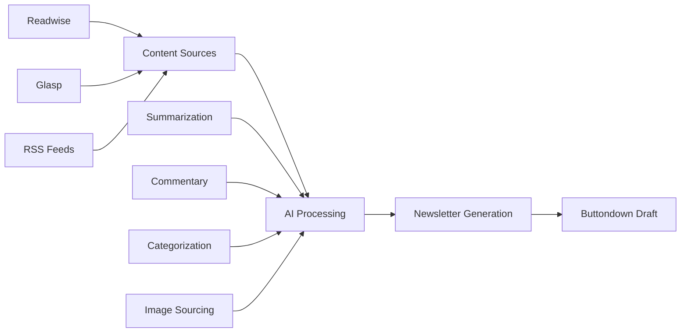

# Newsletter Automation Bot 🤖📧

[](https://github.com/nycterent/thefilter/actions)
[](https://hub.docker.com/)
[](https://opensource.org/licenses/MIT)
[](https://www.python.org/downloads/)

Transform your newsletter creation from a 4-6 hour manual process into a 15-30 minute review task. This bot automatically aggregates content from your favorite sources, processes it with AI, and creates publication-ready drafts.

## ✨ Features

- 🔄 **Multi-source content aggregation**: Readwise, Glasp, RSS feeds
- 🧠 **AI-powered processing**: OpenRouter integration for summaries and commentary  
- 🖼️ **Automatic image sourcing**: Unsplash integration for relevant images
- 🔒 **Paywall detection**: Identifies paywalled content (extensible for alternatives)
- ⏰ **Scheduled automation**: Weekly Saturday generation + manual triggers
- 🌐 **Web interface**: Manual control and status monitoring
- 🐳 **Docker deployment**: Easy containerized setup
- 🔐 **Infisical secrets management**: Self-hosted secrets with GitHub Actions integration
- 📊 **Monitoring tools**: Health checks and log management

## 🚀 Quick Start

### Prerequisites

- Docker & Docker Compose
- API keys from: Readwise, Glasp, Buttondown, OpenRouter, Unsplash
- RSS feed URLs for content aggregation

### Installation

```bash
# Clone the repository
git clone https://github.com/yourusername/newsletter-automation-bot.git
cd newsletter-automation-bot

# Run setup script
chmod +x scripts/setup.sh
./scripts/setup.sh

# Configure API keys
cp .env.example .env
# Edit .env with your API keys

# Deploy
chmod +x scripts/deploy.sh
./scripts/deploy.sh
```

### Quick Test

```bash
# Health check
curl http://localhost:8000/health

# Manual generation
curl -X POST http://localhost:8000/api/generate
```

## 📚 Documentation

- [API Setup Guide](docs/api-setup.md) - Getting your API keys
- [GitHub + Infisical Setup](docs/github-infisical-setup.md) - CI/CD secrets management
- [Deployment Guide](docs/deployment.md) - Detailed deployment instructions
- [Customization Guide](docs/customization.md) - Customizing templates and behavior
- [Troubleshooting](docs/troubleshooting.md) - Common issues and solutions

## 🎯 How It Works



## 🔧 Configuration

### Environment Variables

```bash
# Content Sources
READWISE_API_KEY=your_readwise_token
GLASP_API_KEY=your_glasp_token
RSS_FEEDS=https://feed1.com/rss,https://feed2.com/rss

# Newsletter Platform  
BUTTONDOWN_API_KEY=your_buttondown_token

# AI Processing
OPENROUTER_API_KEY=your_openrouter_key

# Image Search
UNSPLASH_API_KEY=your_unsplash_access_key
```

### Scheduling

By default, runs every Saturday at 9:00 AM. Customize in `scheduler/scheduler.py`:

```python
'schedule': crontab(hour=9, minute=0, day_of_week=6)
```

## 🛠️ Development

### Setup Development Environment

```bash
# Create virtual environment
python -m venv venv
source venv/bin/activate

# Install in development mode
pip install -e ".[dev]"

# Run tests
pytest

# Run linting
black src/
isort src/
flake8 src/
```

### Project Structure

```
newsletter-automation-bot/
├── src/                    # Source code
├── web/                    # Web interface
├── scheduler/              # Task scheduling
├── scripts/                # Deployment scripts
├── docs/                   # Documentation
├── tests/                  # Test suite
└── templates/              # Newsletter templates
```

## 🤝 Contributing

We welcome contributions! Please see [CONTRIBUTING.md](CONTRIBUTING.md) for details.

1. Fork the repository
2. Create your feature branch (`git checkout -b feature/amazing-feature`)
3. Commit your changes (`git commit -m 'Add amazing feature'`)
4. Push to the branch (`git push origin feature/amazing-feature`)
5. Open a Pull Request

## 📝 License

This project is licensed under the MIT License - see the [LICENSE](LICENSE) file for details.

## 🆘 Support

- 📖 Check the [documentation](docs/)
- 🐛 Report bugs via [GitHub Issues](https://github.com/yourusername/newsletter-automation-bot/issues)
- 💬 Join discussions in [GitHub Discussions](https://github.com/yourusername/newsletter-automation-bot/discussions)

## ⭐ Star History

[](https://star-history.com/#yourusername/newsletter-automation-bot&Date)

---

Made with ❤️ for newsletter creators who value their time
